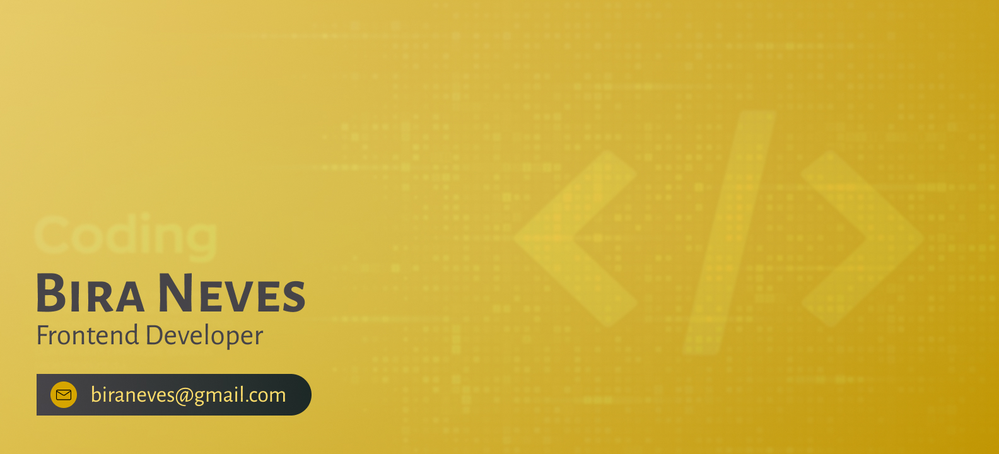

# Hello, I'm Bira Neves! 🖖 👨🏻‍💻

I started programming in the '80s, diving into the technological evolution that honed my software development skills - a fundamental part of who I am. But that's not all; I am also passionate about biology 🧬 ans teaching science 👨‍🔬. Merging these worlds has given me a unique edge in the field of education, where I've made a significant impact.

Currently, I'm working on my degree in Computer Science 🎓. In the meantime, I dedicate myself to educational consulting, bringing forward innovative ideas.

I'm also a strong supporter of open-source software 💾, sharing knowledge and promoting free speech 🗣️. I recognize the value in proprietary software too - everything has its own place!

## A bit more about me:

-   👀 I'm also interested in Data Science
-   🌱 I'm currently writing a comprehensive book on Microsoft Excel
-   📚 I'm a student at EBAC, specializing in Frontend Engineering
-   🎮 I love video games, although time is scarce... My favorite game is Minecraft!

## My favorite technologies

## Find me on the web! 🌎

-   **Twitter:** [@biraneves](https://twitter.com/biraneves)
-   **Instagram:** [biraneves](https://instagram.com/biraneves)
-   **LinkedIn:** [I also share contents here!](https://www.linkedin.com/in/ubirajara-neves/)

