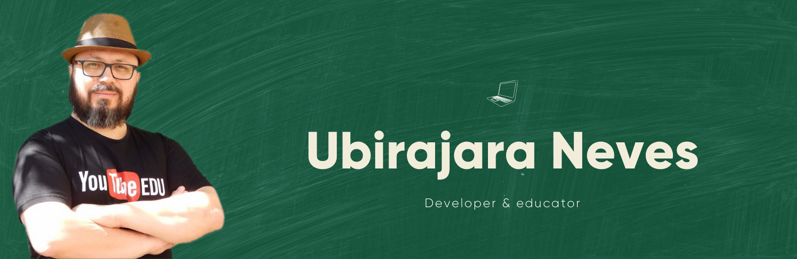

# Hi, I'm Bira Neves! 🖖🏻👨🏻‍💻

I'm a self taught developer since the 1980s. Software development is a very important part in my life, but I'm also a Biologist 🧬 and a Science Teacher 👨🏻‍🏫. I've been involved with Education for a long, long time.

At present, I'm a Bachelor degree student in **Information Systems** at EACH-USP, São Paulo, Brazil. I'm also an MBA student at PUC-RS. Beside that, I work in the commercial department of an awesome company - [Geekie](https://geekie.com.br), and I'm proud to be part of this movement that intends to change Education in Brazil.

I'm also an enthusiast about free (as in "free speech"), open-source, software, but I don't have any kind of prejudice against proprietary solutions.

## A little more about me

- 👀 I’m interested in Data Science and Bioinformatics
- 🌱 I’m currently learning Power BI
- 📚 I'm an MBA student at PUC-RS, *Technology for business: AI, data science and big data*
- 🎮 I love videogames, but the time is so short now... My favorite game is Minecraft!

## My favorite technologies

## Find me around the web! 🌎

- **Twitter:** [@biraneves](https://twitter.com/biraneves)
- **Instagram:** [biraneves](https://instagram.com/biraneves)
- **LinkedIn:** [I also share contents here!](https://www.linkedin.com/in/ubirajara-neves/)

