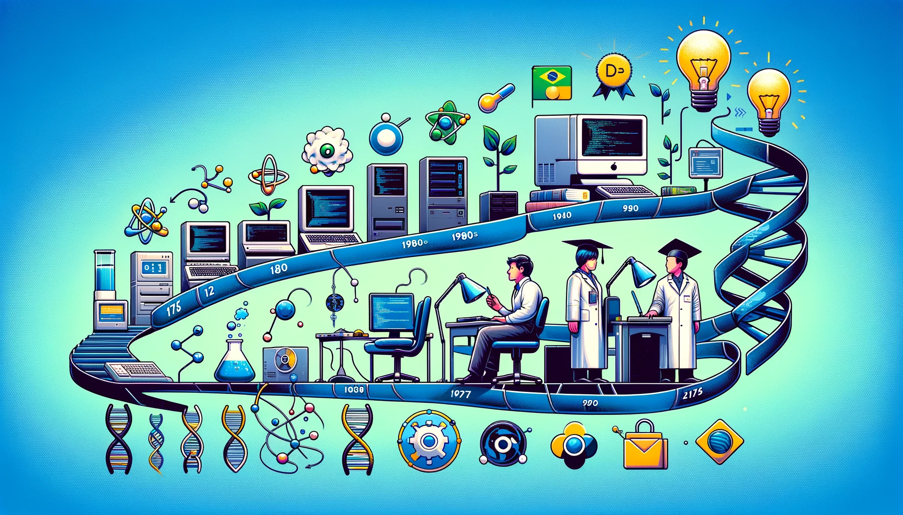

# Hi, I'm Bira Neves! 🖖🏻👨🏻‍💻

I started coding back in the 80s, riding the wave of tech evolution that let me sharpen my dev skills—a big part of who I am. But that's not all; I'm also into biology 🧬 and I teach science 👨‍🔬. Mixing these worlds has given me a unique edge in education, where I've been making an impact for quite some time.

Right now, I'm working on my Computer Science degree 🎓. On the side, I'm leading the charge in educational consulting at a cool company called Geekie. We're all about shaking up Brazilian education by blending tech and fresh ideas into how people learn.

Also, I'm all about open-source software 💾, big on sharing knowledge and keeping speech free 🗣️. But I keep it real and see the worth in proprietary stuff too—everything's got its place!

## A little more about me

- 👀 I’m interested in Data Science and Bioinformatics
- 🌱 I’m currently writing a big book about Microsoft Excel
- 📚 I'm a graduation student at PUC Minas, *Bioinformatics applied to Health*
- 🎮 I love videogames, but the time is so short now... My favorite game is Minecraft!

## My favorite technologies

## Find me around the web! 🌎

- **Twitter:** [@biraneves](https://twitter.com/biraneves)
- **Instagram:** [biraneves](https://instagram.com/biraneves)
- **LinkedIn:** [I also share contents here!](https://www.linkedin.com/in/ubirajara-neves/)

